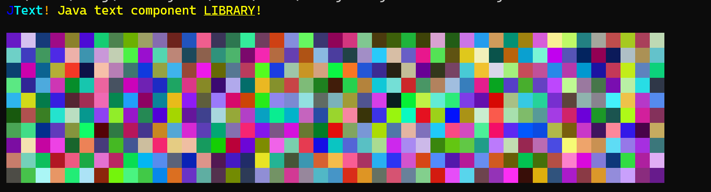

[](https://jitpack.io/#antritus/Jtext)
# JText
Java text component library which has built in serializer to serialize java components to ANSI text.

## Add it
Add the repository to gradle
```groovy
repositories {
    mavenCentral()
    maven { url = uri("https://jitpack.io") }
}

dependencies {
    implementation("com.github.antritus:Jtext:-SNAPSHOT")
}
```

## How to use it
Creates a new component and sends it to the terminal. Parses the component to ANSI text.

```java
package bet.astral.jtext;

import bet.astral.jtext.ansi.ANSISerializer;
import bet.astral.jtext.color.Colors;
import bet.astral.jtext.color.simple.Color;
import bet.astral.jtext.component.Component;
import bet.astral.jtext.style.Style;
import bet.astral.jtext.utils.TriState;

import java.util.Random;

public class Test {
    public static void main(String[] args) {
        ANSISerializer serializer = new ANSISerializer();

        Component component = Component.empty().color(Colors.YELLOW)
                .append(Component.text("J", Colors.BLUE)
                        .appendText("Text", Colors.AQUA)
                        .appendText("!", Colors.ORANGE)
                        .appendSpace())
                .appendText("Java text component ")
                .appendText("LIBRARY", null,
                        Style.builder()
                                .setUnderlined(TriState.TRUE)
                                .setBold(TriState.TRUE)
                                .build()).appendText("!");

        serializer.println(component);
        System.out.println();

        Random random = new Random(0x606060F6);
        for (int i = 0; i < 10; i++) {
            Component header = Component.empty();
            for (int j = 0; j < 45; j++) {
                header.append(Component.text("  ").backgroundColor(new Color(random.nextInt(255), random.nextInt(255), random.nextInt(255))));
            }
            serializer.println(header);
        }
    }
}

```
